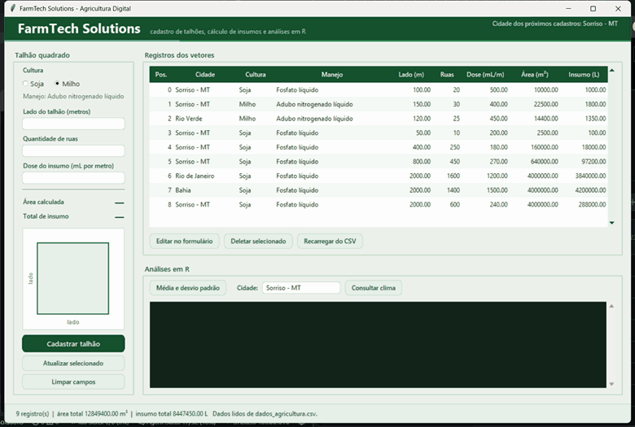
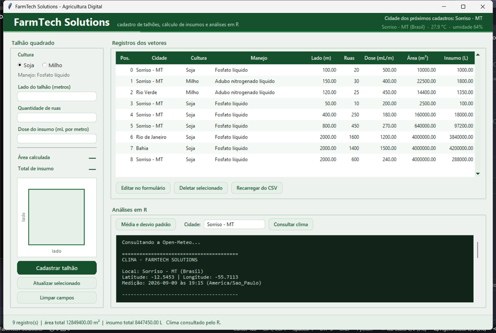

# FarmTech Solutions — Agricultura Digital

Projeto da fase 1 da FIAP. Uma aplicação de terminal em **Python** cadastra talhões de
soja e milho, calcula a área plantada e o insumo necessário, e grava tudo em CSV. Duas
aplicações em **R** consomem esses dados: uma calcula estatísticas e a outra consulta
uma API meteorológica pública.

A mesma lógica também pode ser usada por uma **interface visual em Tkinter**, uma camada
adicional que não substitui nem altera o menu de terminal.



Acima, a interface em uso: o talhão sendo digitado com a área e o insumo calculados a
cada tecla, o cadastro entrando na tabela, e as estatísticas vindas do `estatisticas.R`.

Abaixo, a mesma tela com o clima de Sorriso - MT consultado pelo `clima.R` e exibido no
cabeçalho:



## Rodar no navegador, sem instalar nada

Dá para executar o projeto inteiro pelo GitHub Codespaces, sem baixar o repositório e
sem instalar Python nem R na máquina:

[](https://codespaces.new/henricofernandes/FarmTech-Solutions)

1. Clique no botão acima e confirme em **Create codespace**.
2. Espere o ambiente montar. Na primeira vez leva alguns minutos, porque é aí que o R e
   o `jsonlite` são instalados.
3. Quando a aba **Ports** mostrar a porta `6080`, abra ela no navegador.
4. Clique em **Connect** e use a senha `farmtech`.

A janela do FarmTech abre sozinha nesse desktop remoto, já com as análises em R
funcionando. Se você fechar a janela e quiser abrir de novo, rode no terminal do
Codespaces:

```bash
DISPLAY=:1 python3 python/interface.py
```

Para usar o menu de terminal em vez da janela, `python3 python/farmtech.py` funciona
normalmente no terminal do Codespaces.

É preciso ter conta no GitHub, e o tempo de uso sai da cota gratuita mensal de Codespaces
de quem abrir. Toda a configuração desse ambiente está em `.devcontainer/`.

## Integrantes do grupo

| Nome | RM |
|---|---|
| Henrico Fernandes | rm575348 |
| PREENCHER_NOME | PREENCHER_RM |
| PREENCHER_NOME | PREENCHER_RM |
| PREENCHER_NOME | PREENCHER_RM |
| PREENCHER_NOME | PREENCHER_RM |

## Estrutura

```
FarmTech-Solutions/
├── .devcontainer/                   ambiente do Codespaces (Python, Tkinter, R e desktop)
├── python/farmtech.py               aplicação principal (menu, vetores, cálculos, CSV)
├── python/interface.py              interface visual em Tkinter sobre a mesma lógica
├── r/estatisticas.R                 média e desvio padrão a partir do CSV
├── r/clima.R                        clima em tempo real pela API Open-Meteo
├── dados/dados_agricultura.csv      registros gerados pelo Python
├── dados/cidades.csv                cidade de cada talhão (arquivo auxiliar)
├── docs/                            documentação detalhada de cada parte
├── formacao-social/link-artigo.txt  artigo da Embrapa escolhido e a formatação exigida
└── video/link-video.txt             link do vídeo de demonstração
```

## Pré-requisitos

| Ferramenta | Uso | Observação |
|---|---|---|
| Python 3 | aplicação principal e interface | só biblioteca padrão (`csv`, `pathlib`, `shutil`, `subprocess`, `sys`, `threading`, `tkinter`) |
| R | estatísticas e clima | necessário para as opções de análise |
| Pacote `jsonlite` | ler o JSON da API | instale com `install.packages("jsonlite")` |

## Como executar

Abra o terminal na pasta do projeto.

```powershell
python python/farmtech.py     # aplicação principal (menu de terminal)
python python/interface.py    # a mesma aplicação em janela
Rscript r/estatisticas.R      # média e desvio padrão dos talhões
Rscript r/clima.R             # clima do local padrão (Sorriso - MT)
Rscript r/clima.R Rio Verde   # clima de outra cidade
```

Se o terminal responder que `Rscript` não é reconhecido, o R não está no PATH. Use o
caminho completo, por exemplo `& "C:\Program Files\R\R-4.6.1\bin\Rscript.exe" r/clima.R`.
Rodando pelo menu do Python isso não é necessário: ele procura o `Rscript` no PATH e,
se não achar, nas pastas de instalação do R em `C:\Program Files\R`.

Os caminhos são resolvidos a partir da localização dos próprios scripts, então os
comandos funcionam mesmo se você estiver em outra pasta.

## Como as três partes se conversam

O CSV é o único ponto de troca de dados entre Python e R. Não há banco de dados nem API
entre eles: o Python escreve o arquivo, o R lê.

```
Python (vetores) ──> dados/dados_agricultura.csv ──> R (estatísticas)
                                                     R (clima) ──> API Open-Meteo
```

A cada cadastro, atualização ou deleção, o Python reescreve o CSV inteiro a partir dos
vetores. É o que garante que o arquivo seja sempre um espelho exato do que está na
memória, inclusive depois de uma deleção que muda as posições de todos os registros.

Quem dispara as análises é o menu do Python, que chama o `Rscript` como um programa
externo: a opção 2 roda o `estatisticas.R` logo depois de listar os registros, e a
opção 5 roda o `clima.R` passando a cidade como argumento. O cálculo estatístico e o
acesso à internet acontecem sempre do lado do R.

A interface visual entra nesse fluxo como um segundo cliente da mesma lógica: ela importa
o `farmtech.py`, mexe nos mesmos vetores, grava pelo mesmo `salvar_csv()` e chama os
mesmos scripts em R, só exibindo o resultado em janela em vez de terminal. Por isso não
convém abrir as duas ao mesmo tempo — cada uma reescreve o CSV inteiro a partir da sua
memória, e a última a salvar venceria.

## Documentação detalhada

| Documento | Conteúdo |
|---|---|
| [docs/python.md](docs/python.md) | menu, vetores, cálculos, validações e persistência |
| [docs/interface.md](docs/interface.md) | a interface visual e como ela reaproveita o `farmtech.py` |
| [docs/r.md](docs/r.md) | os dois scripts em R, estatísticas e API meteorológica |
| [docs/dados.md](docs/dados.md) | formato dos arquivos CSV e regras dos dados |

## Situação dos requisitos

Atendidos: duas culturas (soja e milho), cálculo de área, manejo de insumos, dados em
vetores, menu com entrada, saída, atualização por posição, deleção e sair, rotinas de
loop e decisão, estatísticas em R, e o "ir além" com a API meteorológica pelo R. Como
extra, a interface visual em Tkinter expõe todas essas operações em janela.

Pendentes: escrever o resumo de Formação Social, já que o artigo está escolhido em
`formacao-social/link-artigo.txt` mas o `resumo-artigo.pdf` ainda não existe; e gravar o
vídeo, cujo link continua em branco no `video/link-video.txt`. Há também um ponto em aberto no cálculo de área — as duas
culturas usam a mesma figura geométrica (quadrado), e o enunciado pode estar pedindo
uma figura diferente para cada cultura.
