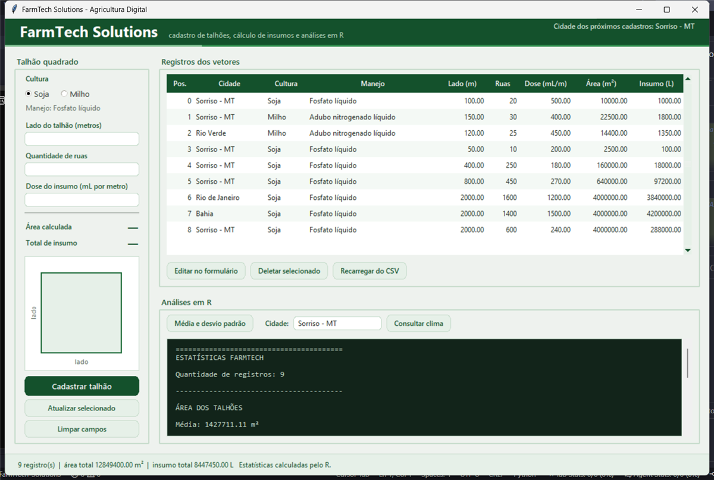

# Interface visual — `python/interface.py`

Janela em Tkinter que faz as mesmas cinco operações do menu de terminal: cadastrar,
listar, atualizar por posição, deletar por posição e disparar as análises em R.

É uma camada adicional, não uma substituição. O `python/farmtech.py` não foi alterado em
nenhuma linha e continua funcionando pelo terminal como sempre.

## Execução

```powershell
python python/interface.py    # interface visual
python python/farmtech.py     # menu de terminal (inalterado)
```

Sem instalar nada, a interface também roda no navegador pelo GitHub Codespaces: o
`README.md` traz o botão e o passo a passo, e o ambiente está descrito em
`.devcontainer/`.

Só a biblioteca padrão é usada. O Tkinter já vem com o Python no Windows, então não há
nada para instalar.

## Como ela se apoia no `farmtech.py`

O arquivo fica dentro de `python/` justamente para poder fazer `import farmtech` sem
transformar o projeto em pacote. Como o `farmtech.py` tem a guarda
`if __name__ == "__main__"`, importá-lo não abre o menu nem lê arquivo nenhum.

A interface não tem cópia da regra de negócio: ela opera sobre os próprios vetores do
módulo e chama as funções dele.

| Vem do `farmtech.py` | Usado para |
|---|---|
| `culturas`, `manejos`, `lados`, `ruas`, `doses`, `cidades` | o estado é o mesmo, não há segunda lista |
| `cidade_atual` | cidade dos próximos cadastros, mostrada no cabeçalho |
| `calcular_area()`, `calcular_insumo()` | prévia ao vivo e colunas da tabela |
| `carregar_csv()`, `salvar_csv()` | leitura na abertura e gravação a cada operação |
| `encontrar_rscript()`, `SCRIPT_ESTATISTICAS`, `SCRIPT_CLIMA` | chamada dos scripts em R |
| `CIDADE_PADRAO`, `ARQUIVO_CSV` | local padrão e nome do arquivo na barra de status |

## A janela


Quatro áreas em uma tela só:

**Cabeçalho** — o nome do projeto e, à direita, a cidade dos próximos cadastros. Embaixo
dela aparece um resumo do clima (local, temperatura e umidade) depois de uma consulta
bem-sucedida, montado a partir da saída do próprio `clima.R`. Antes da primeira consulta
a linha fica vazia, e medidas que a API não informou ficam de fora do resumo.

**Formulário do talhão** — cultura por botão de opção, com o manejo aparecendo sozinho
logo abaixo, mais os campos de lado, ruas e dose. Área e total de insumo são
recalculados a cada tecla, então o resultado aparece antes de salvar.

**Desenho do talhão** — o quadrado com as ruas representadas por linhas verticais e o
lado indicado nos dois eixos. Acima de 24 ruas o desenho mostra apenas uma amostra, para
não virar um borrão.

**Tabela de registros** — as nove informações de cada talhão, com a posição do vetor na
primeira coluna, que é o que a atualização e a deleção usam. Clicar duas vezes numa
linha joga os valores dela no formulário.

**Painel de análises em R** — os botões de estatísticas e de clima, com a saída do R
impressa dentro da janela.



## Decisões de implementação

### A saída do R aparece na janela

O `rodar_script_r()` do `farmtech.py` deixa o R escrever direto no terminal, que aqui não
existe. Então a interface monta a própria chamada com `capture_output=True` e
`encoding="utf-8"` e joga o texto no painel. O localizador de `Rscript` e os caminhos dos
scripts continuam sendo os do `farmtech.py`, e no Windows a chamada usa
`CREATE_NO_WINDOW` para o console não piscar na frente da janela.

O cálculo estatístico e o acesso à internet seguem acontecendo só do lado do R, como
antes. A interface apenas exibe.

### As consultas rodam em thread

Uma consulta à Open-Meteo leva alguns segundos, e durante uma chamada síncrona o Tkinter
para de redesenhar e a janela parece travada. Os scripts rodam numa thread separada, com
os botões desabilitados enquanto isso, e o resultado volta para a janela pelo `after()`,
que é a forma segura de tocar em widget fora da thread principal.

### Recarregar precisa limpar os vetores antes

O `carregar_csv()` faz `append` sem esvaziar as listas. Chamá-lo duas vezes duplicaria
todos os registros, então o botão "Recarregar do CSV" limpa os seis vetores primeiro.

### Validação com a mesma regra, em outro formato

O `ler_numero()` do terminal é um laço em volta do `input()`, que não serve para campo de
formulário. A interface repete a regra — maior que zero, vírgula ou ponto como separador,
ruas inteiras — em uma função que recebe texto e devolve número ou levanta erro, e o erro
vira uma caixa de aviso. O par cultura/manejo também é declarado aqui, porque no
`farmtech.py` ele vive dentro do `ler_cultura()`, preso ao `input()`.

### A cidade só muda se o R confirmar

Igual ao terminal: se o `clima.R` não encontrar a cidade e sair com código diferente de
zero, o campo volta ao valor anterior e nenhum cadastro novo é marcado com um nome que
não existe. A atualização de um registro também regrava a cidade atual nele, exatamente
como a opção 3 do menu faz.

## Um por vez

As duas interfaces guardam os registros em memória e reescrevem o CSV inteiro a cada
operação. Se as duas estiverem abertas ao mesmo tempo, a última a salvar apaga o que a
outra fez. Use uma por vez — ou aperte "Recarregar do CSV" antes de mexer, se tiver
mexido pelo terminal.
